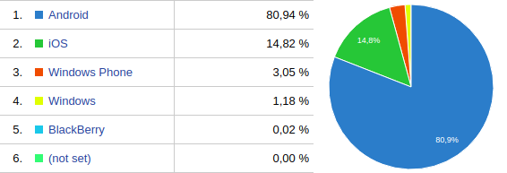
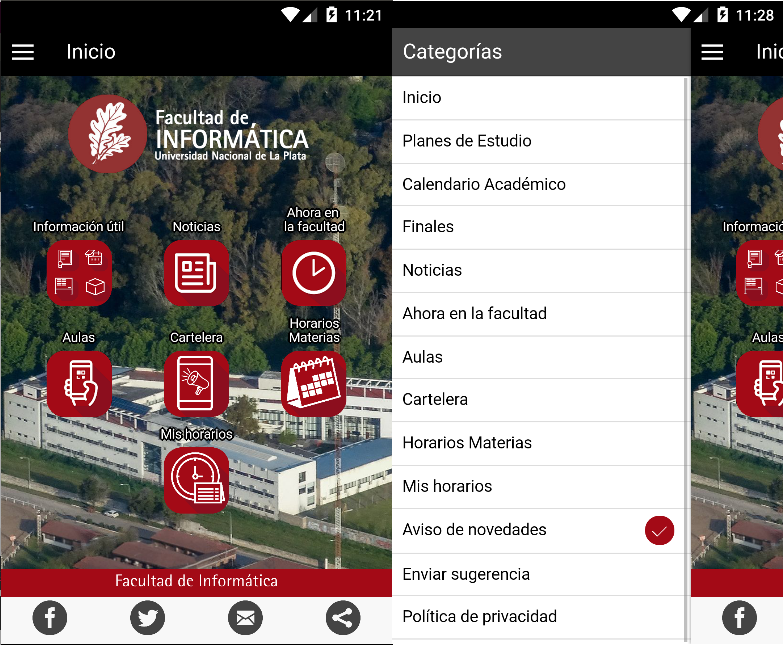
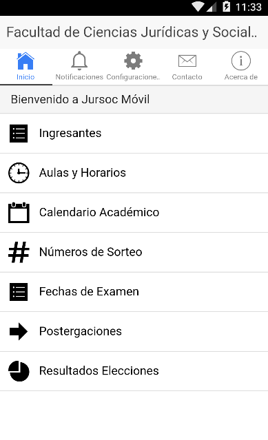

:title: Defensa: Tesina de Licenciatura (Luciano Coggiola)
:author: Luciano Coggiola
:description: Defensa Tesina de grado: "Mi Universidad: una aplicación móvil para mejorar la experiencia de usuario de los estudiantes de la Universidad Nacional de La Plata". Tesina de Licenciatura en Informática de Luciano Coggiola.
:keywords: presentación, tesina, unlp, facultad de informática, defensa, mi universidad, luciano coggiola, app, móvil
:css: estilos/unlp.css
      estilos/presentacion.css

.. header::
    .. image:: imagenes/logos/unlp_logo.png
    .. image:: imagenes/logos/facultad_informatica_logo.png

----

:id: principal

Tesina de Licenciatura
======================

"Mi Universidad: una aplicación móvil para mejorar la experiencia de usuario de los estudiantes de la Universidad Nacional de La Plata."
----------------------------------------------------------------------------------------------------------------------------------------
Autor: Luciano Coggiola.

Directores: Javier Díaz, Paola Amadeo.

Asesor Profesional: Alejandra Osorio.

.. note::
  Realizar presentación personal:
    - Nombre
    - Presentar directores, y AP y comentar cual es mi relacion laboral
    - Cespi -> Acceso a Sistemas universitarios.

----

:id: introduccion
:data-y: r1000

Introducción
============

* **Smartphones:** *amplio uso*.

  * **Tecnologías:** *GPS, notificaciones, cámara...* 

* Sistemas abiertos. 

**Comunicación**: mejora UX.

**Integración de servicios**: Interfaz genérica

.. note::

  - **Amplio uso**: La penetración de smartphones: 24% de la población, propietarios -> alta dependiencia. El 71% de estos, accede a Internet todos los días desde su teléfono inteligente, y no sale de su casa sin llevarlo. Implicación: Presencia: quienes incluyan tecnologías móviles como parte central de su estrategia, se beneficiarán de la oportunidad de atraer a estos nuevos usuarios conectados en forma permanente.
  - **Mayor comunicación**
  - **Tecnologías**: GPS, lector de huellas, notificaciones, acelerometro, camara -> integracion de tecnologias
  - Universidades utilizan sistemas abiertos -> Solucion disponible a otras universidades.

  **Comunicacion**: enriquezca entre los alumnos y la entidad -> mejorar su experiencia de usuario

----

:data-y: r0
:data-x: r1400

Objetivos
=========

Desarrollo de aplicación móvil
------------------------------

Integración de servicios para mejorar:

    * **Comunicación** entre alumnos, Universidad y Dependencias.

    * **Sociabilización** de contenidos

    * **Presencia** de la UNLP.

.. note::

    Integración para esta tesina: Moodle y guarani con app.

----

:id: objetivos_especificos

Objetivos específicos
=====================

Analizar:

* Contexto y aplicaciones existentes

* Herramientas para desarrollo de apps móviles.

* Servicios existentes (UNLP)

Desarrollar:

* Aplicación móvil

* API de integración

* Plugin Guaraní

* Plugin Moodle

Verificar Usabilidad.

.. note::

  - apps existentes en Argentina y el mundo para determinar las caracterısticas mas relevantes de este desarrollo
  - herramientas existentes: desarrollo app, multiplataforma, aprovechando tecnologias
  - integracion servicios UNLP
  - Desarrollo App: comunicar/representar info
  - API: interfaz genérica, segura
  - guaraní: contribución a universidades
  - moodle: idem, open source.
  - tecnicas de usabilidad para verificar el impacto en el uso de la herramienta. Estas permiten obtener un feedback de los potenciales usuarios

----

:data-y: r1000
:data-x: 0
:id: cap_1

Contexto
========

----

:id: cap_1_oss
:data-x: r500
:data-y: r0
:data-scale: 0.1

Sistemas Operativos móviles
===========================

.. note::
  - "Si pensamos en una app", debemos analizar implementacion a qué plataformas está enfocada (tesis)
  - Google Analytics: 01/2017 a 09/2017 en UNLP (guarani, cespi). Fechas pico de uso.
  - comentar sobre versiones: 4.4 o superiores (94%).
  - Enlazar con "algunas aplicaciones existentes"

----

:id: cap_1_apps
:data-y: r100
:data-x: r0

Aplicaciones móviles universitarias
===================================

* **UNLP y Argentina**: Informática UNLP, Jursoc UNLP, UNLP ART

* **Otros paises**: Kurogo, Harvard, Oxford

.. note::

  - Info UNLPNovedades, aulas y horarios (de materias, código QR), info institucional y academica.
  - jursoc: Ubicacion de edificio GPS, nros sorteo.
  - ART: tels útiles, trámites.
  - Resaltar Kurogo: plataforma (Modo Labs) para crear apps móviles. Modular. Calendario, mensajeria, Biblioteca, emergencias, comedor, estacionamiento.

----

:data-y: r0
:data-x: r250

Principales características
===========================

* Novedades

* Planificación estudiantil

* Geolocalización

* Presencia Universitaria

.. note::
  - novedades: : diversidad en la forma de comunicacion en la universidad. Multiples apps. "pull to refresh".
  - planificacion estudiantil: organizacion de fechas/horarios. Apps: Timetable (administrar tareas, examenes, sincronizar calend.)
  - Geoloc.: : < costos y > acceso red => Uso de geoloc. 
  - presencia: presente en los dispositivos moviles (smartphones y tablets), ámbito de las aplicaciones y tiendas virtuales, estableciendo un canal de difusion de contenidos.
  - Concluir, para pasar al desarrollo.
  
----

:data-y: r1000
:data-x: 0
:data-scale: 1
:id: cap_2_3

Marco teórico y desarrollo
==========================

.. note::

  Considerar los mecanismos para:
    - **Licencia**: Expresar la libertad de uso, copia y modificación del desarrollo.
    - Brindar un mecanismo genérico para integrar información útil para el estudiante, entre distintos sistemas implementados en la unlp (**API para servicios externos**).
    - Comunicar datos de interés entre el *backend* y los dispositivos móviles.    
    - Proveer nuevas operaciones y que estas estén disponibles para su uso externo, a través de otros sistemas (**plugins**).
    - Representar estos datos en una aplicación móvil, de manera sencilla y que el usuario encuentre cómodo al momento de su utilización (**Usabilidad**).

----

:id: cap_2_3_software_libre
:data-x: r800
:data-y: r0
:data-scale: 0.1

Licencia
========

Software Libre
--------------

*  Seguridad
*  Calidad
*  Personalización
*  Libertad
*  Interoperabilidad
*  Auditabilidad
*  Opciones de soporte
*  Gratuidad
*  Pruebas

.. note::

	*  La seguridad: Cuantas más personas vean el código, es más probable que detecten errores y los corrijan. Esto tiene un impacto directo en el marco de la seguridad.
	*  La calidad: En relación con el inciso anterior, la cantidad de usuarios de un desarrollo, también influye, ya que permite que estos incorporen nuevas funcionalidades o las mejoren.
	*  Personalización: Al permitir modificaciones, habilita a que estas se realicen para adaptarse a las necesidades del usuario u organismo.
	*  La libertad: La utilización de software de "código abierto" libera el hecho de "estar atado" a una tecnología propietaria.
	*  La interoperabilidad: Suele adhiere más a los estándares libres que el software privativo, lo que evita estar limitado al uso de formatos cerrados.
	*  La auditabilidad: La visibilidad del código permite a los usuarios ver las acciones que este ejecuta.
	*  Las opciones de soporte: El soporte es gratis a través de la asistencia de la comunidad de usuarios y desarrolladores. También existe el soporte pago, cuando es requerido asegurarse un mantenimiento.
	*  La gratuidad (sin costo): por definición es gratis.
	*  Las pruebas de un producto: Ayuda a evaluar un software antes de utilizarlo.

----

:id: cap_2_3_gnu_gpl

GNU GPL v3
==========

+---------------------------------+---------------------------------------------------------+
| Backend (API)                   | https://github.com/tanoinc/mi-universidad-api.          |
+---------------------------------+---------------------------------------------------------+
| Frontend (App móvil)            | https://github.com/tanoinc/mi-universidad-app.          |
+---------------------------------+---------------------------------------------------------+
| Plugin Moodle                   | https://github.com/tanoinc/moodle-message_miuniversidad |
+---------------------------------+---------------------------------------------------------+
| Plugin Guaraní                  |  Universidades.                                         |
+---------------------------------+---------------------------------------------------------+
| Tesis (LaTeX)                   | https://github.com/tanoinc/tesis                        |
+---------------------------------+---------------------------------------------------------+
| Esta presentación (Hovercraft!) | https://github.com/tanoinc/tesis-presentacion           |
+---------------------------------+---------------------------------------------------------+

.. image:: imagenes/presentacion/octocat.png
  :height: 150em

.. note::

  * **GNU GPL v3**: Richard Stallman -> proyecto GNU. Garantias al usuario final: utilizar, compartir, estudiar y cambiar el software. Su objetivo es declarar que los desarrollos que estén bajo esta licencia sean **libres** y estén protegidos por **copyleft**, **evitando** que futuras modificaciones por terceros **restrinjan las libertades que brinda esta licencia**.

----

:data-x: 0
:data-y: r500

Backend
=======
Servicios Web
-------------
* SOAP
* REST

SOAP vs REST... 
~~~~~~~~~~~~~~~

	**REST!**

.. note::
  REST: Roy Fielding
  soap vs rest conclusion: mayor flexibilidad, mas liviana, tecnologıas -> uso generalizado, y se adapta correctamente a las necesidades de conexion de los dispositivos moviles y de otros servicios externos que consuman la informacion provista.

  Ademas facilita la posibilidad de escalar horizontalmente y permite el uso de cache.

----

:data-x: r800
:data-y: r0

API RESTful
===========

*  Sin estado
*  Orientada a recursos
*  Acceso mediante URI
*  Uso de métodos HTTP
*  Representación de los recursos en *XML* o *JSON*
*  Estado de respuesta utilizando códigos  *HTTP*
*  Versionable?

.. note::

	*  **Sin estado**: No debe almacenar información de contexto del cliente. DATOS => se envían en cada pedido (incluidos datos de autenticación. Por qué?  escalabilidad y => performance. Sin estados en servidor => no necesidad de sincronizar distintos nodos.

	*  **Orientada a recursos**: concepto del recurso. Cada recurso es componente distribuido que permite ser accedido directamente. COMO ACCEDER? siguientes puntos...

	*  **Acceso mediante uri**: URI: principal interfaz de manipulación de los datos. auto-descriptiva = correcta (intuitiva). que de manera intuitiva se pueda predecir, o al menos saber dónde buscar, el acceso al recurso. Estructura jerárquica (de forma similar a la organización de los directorios).

	*  **Uso de métodos http**: acciones => verbos HTTP => CRUD. Cada verbo tiene una semántica asociada que implica un comportamiento implícito de la API.
	*  **Representación de los recursos en XML o json**: Manera en que info es codificada = formato. XML o JSON. Uno no es superior al otro... Necesidades. MiUniversidad en JSON: no requiere la existencia de datos complejos. simple compacto (menos \eng{overhead}), legible. Bueno para JS
	*  **Estado de respuesta utilizando códigos http**: codigos estándar. Utiles para destinatario o intermediario genérico: cachés, proxies o librerías.

	*  **Versionable**: No está dentro de las recomendaciones. contra a Purismo de REST. Realidad: software cambia, tamben APIs => aspecto relevante. 
	  
