:title: Defensa: Tesina de Licenciatura (Luciano Coggiola)
:author: Luciano Coggiola
:description: Defensa Tesina de grado: "Mi Universidad: una aplicación móvil para mejorar la experiencia de usuario de los estudiantes de la Universidad Nacional de La Plata". Tesina de Licenciatura en Informática de Luciano Coggiola.
:keywords: presentación, tesina, unlp, facultad de informática, defensa, mi universidad, luciano coggiola, app, móvil
:css: estilos/unlp.css
      estilos/presentacion.css

.. header::
    .. image:: imagenes/logos/unlp_logo.png
    .. image:: imagenes/logos/facultad_informatica_logo.png

----

:id: principal

Tesina de Licenciatura
======================

"Mi Universidad: una aplicación móvil para mejorar la experiencia de usuario de los estudiantes de la Universidad Nacional de La Plata."
----------------------------------------------------------------------------------------------------------------------------------------
Autor: Luciano Coggiola.

Directores: Javier Díaz, Paola Amadeo.

Asesor Profesional: Alejandra Osorio.

.. note::
  Realizar presentación personal:
    - Nombre
    - comentar cual es mi relacion laboral
    - Cespi -> Acceso a Sistemas universitarios (guarani, sipu, sipecu, moodle, kimkelen, meran).

----

:id: agenda

Agenda de exposición
====================

1. Introducción y objetivos
2. Contexto
3. Mi Universidad

    a. Backend
    b. Frontend
    c. Funcionalidad
    d. Plugins
    e. Usabilidad

4. Conclusión

----

:id: introduccion
:data-x: 0
:data-y: r1000

Introducción
============

* **Smartphones:** *amplio uso*.

  * **Tecnologías:** *GPS, notificaciones, cámara...* 

* Sistemas abiertos. 

**Comunicación**: mejora UX.

**Integración de servicios**: Interfaz genérica

.. note::

  - **Amplio uso**: La penetración de smartphones: 24% de la población, propietarios -> alta dependiencia. El 71% de estos, accede a Internet todos los días desde su teléfono inteligente, y no sale de su casa sin llevarlo. Implicación: Presencia: quienes incluyan tecnologías móviles como parte central de su estrategia, se beneficiarán de la oportunidad de atraer a estos nuevos usuarios conectados en forma permanente.
  - **Mayor comunicación**
  - **Tecnologías**: GPS, lector de huellas, notificaciones, acelerometro, camara -> integracion de tecnologias
  - Universidades utilizan sistemas abiertos -> Solucion disponible a otras universidades.

  **Comunicacion**: enriquezca entre los alumnos y la entidad -> mejorar su experiencia de usuario

----

:id: intro_integracion
:data-y: r0
:data-x: r1400

----

:data-y: r0
:data-x: r1400

Objetivos
=========

Desarrollo de aplicación móvil
------------------------------

Integración de servicios para mejorar:

    * **Comunicación** entre alumnos, Universidad y Dependencias.

    * **Sociabilización** de contenidos

    * **Presencia** de la UNLP.

.. note::

    Integración para esta tesina: Moodle y guarani con app.

----

:id: objetivos_especificos

Analizar:

* Contexto y aplicaciones existentes

* Herramientas para desarrollo de apps móviles.

* Servicios existentes (UNLP)

Desarrollar:

* Aplicación móvil

* API de integración

* Plugin Guaraní

* Plugin Moodle

Verificar 

* Usabilidad.

.. note::

  - apps existentes en Argentina y el mundo para determinar las características mas relevantes de este desarrollo
  - herramientas existentes: desarrollo app, multiplataforma, aprovechando tecnologias
  - integracion servicios UNLP
  - Desarrollo App: comunicar/representar info
  - API: interfaz genérica, segura
  - guaraní: contribución a universidades
  - moodle: idem, open source.
  - tecnicas de usabilidad para verificar el impacto en el uso de la herramienta. Estas permiten obtener un feedback de los potenciales usuarios

----

:data-y: r1000
:data-x: 0
:id: cap_1

Contexto
========

----

:id: cap_1_oss
:data-x: r500
:data-y: r0
:data-scale: 0.1

Sistemas Operativos móviles
===========================

.. image:: imagenes/presentacion/so_uso.png
    :height: 250em

Datos obtenidos de Google Analytics en los Guaraní de todas las Facultades (Enero a Septiembre, 2017)

.. note::
  - "Si pensamos en una app", debemos analizar implementacion a qué plataformas está enfocada (tesis)
  - Google Analytics: 01/2017 a 09/2017 en UNLP (guarani, cespi). Fechas pico de uso.
  - comentar sobre versiones: 4.4 o superiores (94%).
  - Enlazar con "algunas aplicaciones existentes"

----

:id: cap_1_apps
:data-y: r100
:data-x: r0

Aplicaciones móviles universitarias
===================================

* **El mundo**: Kurogo, Harvard, Oxford

* **UNLP y Argentina**: Informática UNLP, Jursoc UNLP, UNLP ART

.. image:: imagenes/presentacion/unlp_info.png
    :height: 200em

.. image:: imagenes/presentacion/unlp_jursoc.png
    :height: 200em

.. note::

  - Resaltar Kurogo: plataforma (Modo Labs) para crear apps móviles. Modular. Calendario, mensajeria, Biblioteca, emergencias, comedor, estacionamiento.
  - Info UNLPNovedades, aulas y horarios (de materias, código QR), info institucional y academica.
  - jursoc: Ubicacion de edificio GPS, nros sorteo.
  - ART: tels útiles, trámites.

----

:data-y: r0
:data-x: r250

Principales características
===========================

* Novedades

* Planificación estudiantil

* Geolocalización

* Presencia Universitaria

.. note::
  - novedades: : diversidad en la forma de comunicacion en la universidad. Multiples apps. "pull to refresh".
  - planificacion estudiantil: organizacion de fechas/horarios. Apps: Timetable (administrar tareas, examenes, sincronizar calend.)
  - Geoloc.: : < costos y > acceso red => Uso de geoloc. 
  - presencia: presente en los dispositivos moviles (smartphones y tablets), ámbito de las aplicaciones y tiendas virtuales, estableciendo un canal de difusion de contenidos.
  - Concluir, para pasar al desarrollo.
  

----

:data-y: r1000
:data-x: 0
:data-scale: 1
:id: cap_2_3_mi_universidad_pantalla

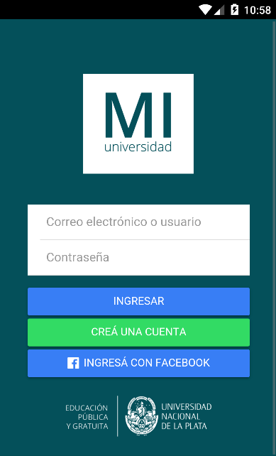

----

:data-y: r0
:data-x: r375
:id: cap_2_3

Mi Universidad
==============

* Licencia

* Integración (backend)

  * Con otros Servicios externos

  * Con Aplicación móvil

* Aplicación móvil (frontend)

* Plugins

* Usabilidad

.. note::

  Considerar los mecanismos para:
    - **Licencia**: Expresar la libertad de uso, copia y modificación del desarrollo.
    - Brindar un mecanismo genérico para integrar información útil para el estudiante, entre distintos sistemas implementados en la unlp (**API para servicios externos**).
    - Comunicar datos de interés entre el *backend* y los dispositivos móviles.    
    - Proveer nuevas operaciones y que estas estén disponibles para su uso externo, a través de otros sistemas (**plugins**).
    - Representar estos datos en una aplicación móvil, de manera sencilla y que el usuario encuentre cómodo al momento de su utilización (**Usabilidad**).

----

:id: cap_2_3_gnu_gpl
:data-x: r800
:data-y: r0
:data-scale: 0.1

GNU GPL v3
==========

+---------------------------------+---------------------------------------------------------+
| Backend (API)                   | https://github.com/tanoinc/mi-universidad-api           |
+---------------------------------+---------------------------------------------------------+
| Frontend (App móvil)            | https://github.com/tanoinc/mi-universidad-app           |
+---------------------------------+---------------------------------------------------------+
| Plugin Moodle                   | https://github.com/tanoinc/moodle-message_miuniversidad |
+---------------------------------+---------------------------------------------------------+
| Plugin Guaraní                  | Colab (SIU)                                             |
+---------------------------------+---------------------------------------------------------+
| Tesis (LaTeX)                   | https://github.com/tanoinc/tesis                        |
+---------------------------------+---------------------------------------------------------+
| Esta presentación (Hovercraft!) | https://github.com/tanoinc/tesis-presentacion           |
+---------------------------------+---------------------------------------------------------+

.. image:: imagenes/presentacion/octocat.png
  :height: 150em

.. note::

  * **GNU GPL v3**: Richard Stallman -> proyecto GNU. Garantias al usuario final: utilizar, compartir, estudiar y cambiar el software. Su objetivo es declarar que los desarrollos que estén bajo esta licencia sean **libres** y estén protegidos por **copyleft**, **evitando** que futuras modificaciones por terceros **restrinjan las libertades que brinda esta licencia**.
  * SIU Comunidad y Javier y LINTI promeve el uso de y desarrollo de software libre
  * -
	*  La seguridad: Cuantas más personas vean el código, es más probable que detecten errores y los corrijan. Esto tiene un impacto directo en el marco de la seguridad.
	*  La calidad: En relación con el inciso anterior, la cantidad de usuarios de un desarrollo, también influye, ya que permite que estos incorporen nuevas funcionalidades o las mejoren.
	*  Personalización: Al permitir modificaciones, habilita a que estas se realicen para adaptarse a las necesidades del usuario u organismo.
	*  La libertad: La utilización de software de "código abierto" libera el hecho de "estar atado" a una tecnología propietaria.
	*  La interoperabilidad: Suele adhiere más a los estándares libres que el software privativo, lo que evita estar limitado al uso de formatos cerrados.
	*  La auditabilidad: La visibilidad del código permite a los usuarios ver las acciones que este ejecuta.
	*  Las opciones de soporte: El soporte es gratis a través de la asistencia de la comunidad de usuarios y desarrolladores. También existe el soporte pago, cuando es requerido asegurarse un mantenimiento.
	*  La gratuidad (sin costo): por definición es gratis.
	*  Las pruebas de un producto: Ayuda a evaluar un software antes de utilizarlo.

----

:id: cap_2_3_integracion
:data-x: 0
:data-y: r500

Integración: Backend
====================

Servicios Web
-------------
  
API REST (JSON) con Autenticación

* Servicios externos: API Key/API Secret

* Aplicación móvil: OAuth2

Lenguaje y framework
--------------------

PHP >= 5.6 y Lumen 5.4 (de Laravel)

Base de datos
-------------
MySQL o Postgres (probadas). Soportadas: SQLite y SQL Server

.. note::
  - REST: JSON(simple, compacto <overhead). Sin estado. Orientada a recursos. Acceso mediante URI. Métodos HTTP (verbos CRUD). Versionable.
  - OAuth2: verificar que aplicaciones tengan los permisos, en nombre del usuario (sin conocer sus credenciales). Resource Owner Password Credentials Grant. Tokens de acceso.
  - API Key/API Secret: identificar al sistema. valida que los datos no fueron adulterados. Sobre https -> encriptado y replay attack.
  - PHP: multiparadigma, multiplataforma, muy usado: 82% (ASP 14, java 2,5). Experiencia.
  - Lumen: microframework de laravel orientado a APIS (sin sesiones y templates). Laravel muy usado. Lumen rápido: 50.000 solicitudes por minuto, y se logró tener respuestas de 6 milisegundos para configuraciones de PHP con HHVM y de 25 milisegundos utilizando PHP-FPM.

----

:id: cap_2_3_backend_diagrama
:data-x: r800
:data-y: r0

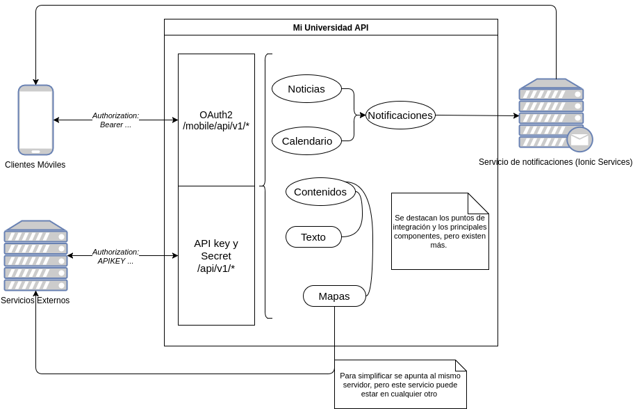

----

:id: cap_2_3_frontend

Frontend
========

Aplicación móvil
----------------

Híbrida: Framework Ionic2 (Apache Cordova)

HTML5, CSS3, Javascript (Angular con TypeScript)

Interfaz de usuario
-------------------

Navegación Primaria: Pestañas (persistente) / Side Drawer (Transitorio)

Navegación Secundaria: Tarjeta/Menú lista

.. note::
  - Híbrdas: **Ventajas**: Multiplataforma. Menor costo. Menor curva de aprendizaje (tecnologías web, > recursos humanos). **Desventajas**: Menor diseño (look and feel). Menor performance.
  - Cordova: Open Source (viene de PhoneGap, Nitobi). Contenedor con Capa Javascript acceder funcionalidad móviles.
  - Ionic2: Framwork. Angular. Typescript. Look and Feel multiplataforma HTML5, CSS3, SASS, transiciones aceleradas por HW. Ventajas: Diseño=> usabilidad. Modificaciones en vivo. Mayor performance. Angular 2 con typescript. PWA. Amplia comunidad. Aclarar soporte version Adroid 4.4 > 94% de estudiantes. OTROS FRAMEWORKS: ReactNative y NativeScript.
  - Interfaz de usuario: se evaluaron otros patrones de diseño de interfaces.

----

:id: cap_2_3_frontend_imagen
:data-x: r200

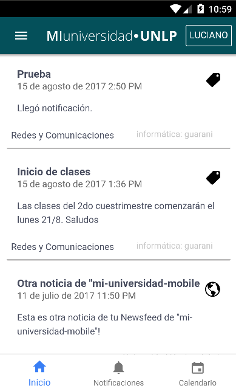

----

:id: cap_2_3_funcionalidad
:data-x: 0
:data-y: r500

Funcionalidad
=============
Algunas definiciones
--------------------

**Puntos de Integración**: *Funcionalidad clave, genérica y transversal a cualquier servicio, que tiene el potencial de ser integrada en la aplicación*

**Servicios externos**: *Sistemas independientes que tienen la capacidad de integrarse a Mi Universidad.*

**Contextos**: *Son "temáticas" definidas por los servicios externos*.

.. note::
  - **Puntos de Integración**: Cabe destacar que hay una relación directa entre estos puntos y la definición de la API, ya que estos serán expuestos a través de ella.
  - **Servicios externos**: Su comunicacion se establece a traves de la API haciendo referencia a los puntos de integracion. Ademas, los usuarios tienen la posibilidad de añadir a sus cuentas personales, los servicios a los cuales esten interesados.

----

:id: cap_2_3_funcionalidad_puntos
:data-x: r800
:data-y: r0

Puntos de Integración
=====================

A continuación:

* Novedades
* Calendario
* Contenidos

  * Mapas de Google

  * Texto

----

:id: cap_2_3_funcionalidad_puntos_novedades

Novedades

.. note::
  - Punto de integración: **Novedades**. Su modalidad de navegación secundaria es de lista y tarjeta (similar a aplicaciones como Facebook, Instagram y YouTube).

----

:id: cap_2_3_funcionalidad_puntos_calendario

Calendario

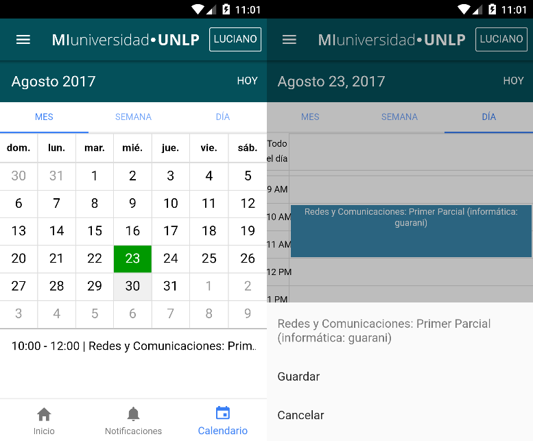

.. note::
  - Punto de integración: **Calendario**.

----

Contenidos: Mapas

:id: cap_2_3_funcionalidad_puntos_mapa

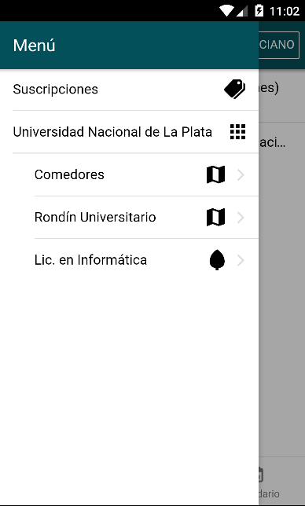
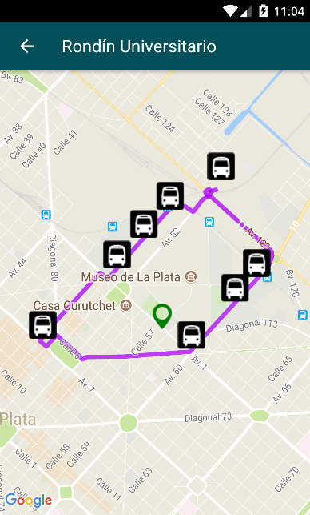

.. note::
  - **Contenidos** dinámico. Los da de alta el servicio externo.
  - Punto de integración: **Contenidos** Google Maps.
  - Solicitud HTTP a una URL externa, obtener datos: **Marcadores** Representan puntos en el mapa asociados con un ícono y un texto. **Centro**, *Polígonos y lineas**
  - Punto de integración: **Contenidos** Texto. Solicitud HTTP a una URL externa. Formato markdown.

----

Noficaciones
============

Tipos
-----

* "Globales" y "No Globales"

  * Con destinatarios

  * Sin destinatarios

  * Con contexto asociado

Ionic Services

.. note::

  - "Globales" y "No Globales"
  - Con destinatarios: Notifican solamente a los usuarios del listado asociado.
  - Sin destinatarios: Notifican a todos los usuarios que utilizan los servicios externos
  - Con contexto asociado: Notifican a todos los usuarios interesados en él. 
  - Utiliza servicio de Ionic: Abstrae diferencias entre implementaciones de los distintos SOs.

----

:id: cap_2_3_funcionalidad_notificaciones

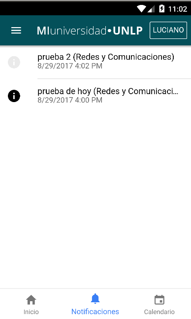

----

Suscripciones
=============
A servicios externos...

Tipos
-----

* Libre
* Requiere autenticación

----

:id: cap_2_3_funcionalidad_secuencia_anadir_servicio

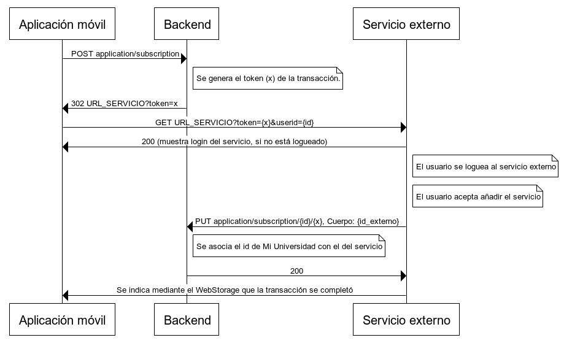

----

:id: cap_2_3_funcionalidad_contextos

Contextos
=========

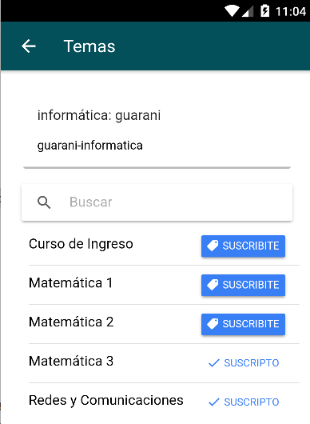

----

Otras funcionalidades
=====================

* Permisos
* Pull to refresh
* Login
* i18n
* Estilos personalizables
* Introducción (configurable)

.. note::
	- Qué operaciones pueden ser utilizadas por cada servicio. Existe un permiso por cada entrada de la API (URL y metodo HTTP).

	- Pull to refresh: estos se pueden refrescar con el gesto "pull to refresh" (deslizar para recargar). Este consiste en deslizar la pantalla hacia abajo para actualizar los contenidos. 

	- Login: Manual o facebook

	- Internacionalización: La aplicación soporta múltiples lenguajes que toma de la configuración del dispositivo. Para el alcance de esta tesis, solo hay definidos dos: Español e Inglés.

	- Estilos personalizables: Mediante Sass (soportado por Ionic) se permiten personalizar los estilos y sus variables en archivos separados. Esto facilita la edición del diseño para otras Universidades. Por otro lado, si se necesitan realizar modificaciones, se puede aprovechar del mecanismo de versionado de GitHub para hacer un fork del proyecto y realizar los cambios necesarios. Ejemplo: rama master y rama UNLP

	- Introducción configurable: La primera vez que se abre la aplicación aparecen una serie de diapositivas, que hacen de tutorial para mostrar las funcionalidades del sistema. Estas son configurables.

----

:id: cap_2_3_funcionalidad_api
:data-x: 0
:data-y: r500

API
===

Utilizada por los servicios externos.

* **POST** /api/v1/newsfeed, /api/v1/calendar_event, content/google_map, /api/v1/content/text
* **DELETE** /api/v1/content/*{id}*
* **GET** /api/v1/geolocation/user/*{id_usuario}*, POST /api/v1/geolocation/users

Códigos de respuesta: 200, 401, 403, 404, 422, 500...

Documentación
-------------
Swagger: https://app.swaggerhub.com/apis/tanoinc/mi-universidad/1.0.0

----

:id: cap_2_3_plugins_guarani
:data-x: 0
:data-y: r500

Plugins
=======

Guaraní
-------

Framework SIU Chulupí (PHP): "Personalización"

* 2.9.x: Informix

* 3.x: Postgres

Funcionalidad

* Interconexión entre usuarios
* Envío de mensajes
* Fechas de parciales

Colab (SIU)

----

:id: cap_2_3_plugins_guarani_imagen
:data-x: r800
:data-y: r0

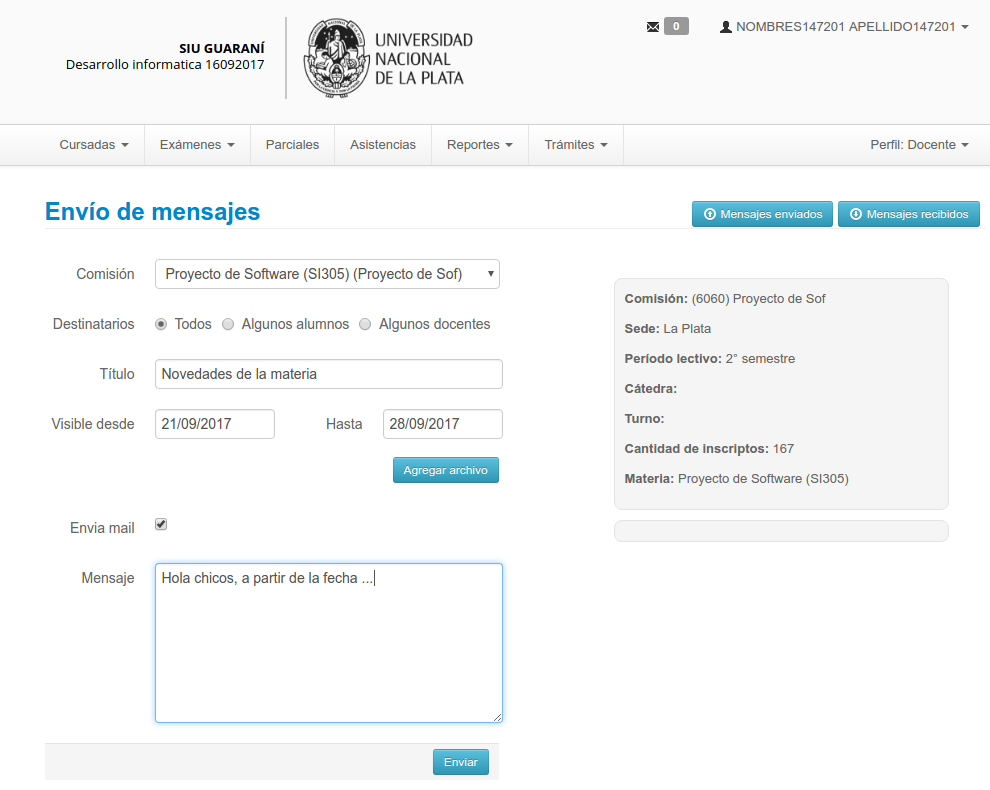

----

:id: cap_2_3_plugins_moodle
:data-x: 0
:data-y: r500

Plugins
=======

Moodle 3
--------

Tipo: *message output*

Funcionalidad

* Mensajería

* Foro de novedades y consultas

GNU GPL v3: GitHub

.. note::
  - Se puede usar en versiones anteriores.
  - Mensajería: Los mensajes personales que se reciban dentro de la plataforma, se envían como novedades personales con notificacion a Mi Universidad. De esta manera un alumno podra saber con una notificación cuando le envían un mensaje privado. Esta característica se puede deshabilitar y es configurable por el usuario desde Moodle.
  - Foro de novedades y consultas: Los anuncios que se realicen en el foro de novedades, seran enviados a traves de Mi Universidad a los alumnos del curso y ademas quedaran asociados a su contexto. De esta manera los alumnos que no pertenezcan al curso pero quieran estar al tanto de las novedades, puedan hacerlo, suscribiendose.

----

:id: cap_2_3_plugins_moodle_imagen
:data-x: r800
:data-y: r0

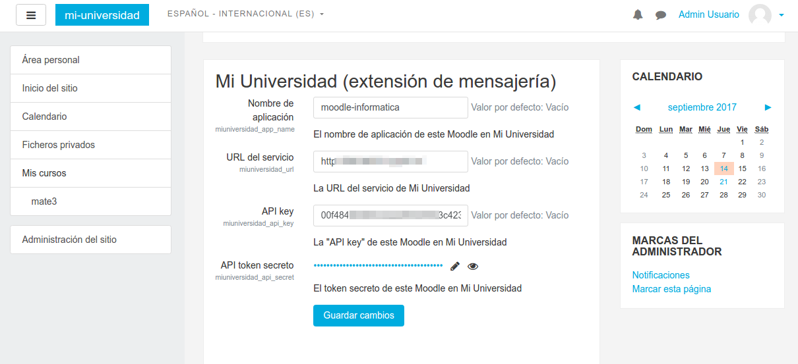
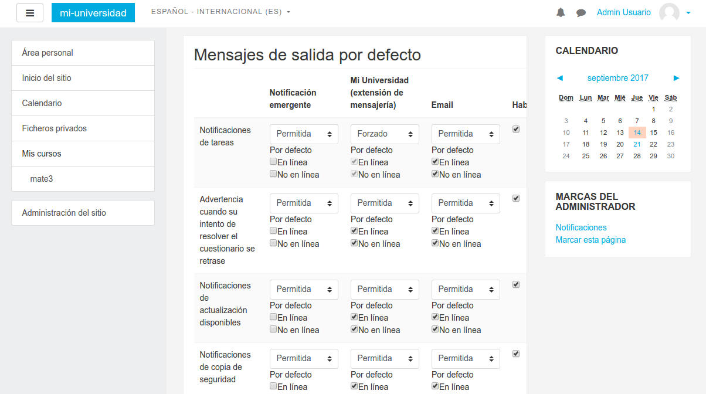

----

:id: cap_2_3_usabilidad
:data-x: 0
:data-y: r500

Usabilidad
==========

Recomendaciones de Nielsen Norman Group:
**Focus group**

Etapa preliminar
----------------

* Preparación del producto

* Selección de participantes

* Selección de coordinación 

.. note::

  - Nielsen Norman Group: estudio a obtener datos de una investigación cualitativa con usuarios.
  - **Focus group**: son una forma de entrevista grupal que se centra en la comunicacion entre los participantes de la investigacion para generar nueva informacion (datos, ideas, correcciones, etcetera).
  - La charla grupal favorecio a la prueba. La **interaccion entre los participantes** permitio explorar el **conocimiento y experiencia de las personas**. De esta manera se pudo explorar no solo lo que pensaban, sino tambien **como lo hacían y por qué**.

----

:data-x: r800
:data-y: r0

Usabilidad
==========

Etapa de diseño
---------------

Lista de tareas

Desarrollo
----------

Reuniones: 18/08 y 13/09 de 2017

----

:id: cap_2_3_usabilidad_focus

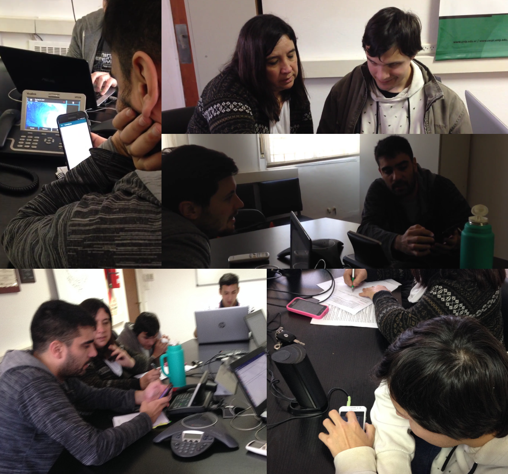

.. note::

  - Accesibilidad: Maxi pertenece a la dirección de accesibilidad de la facultad.

----

:id: cap_2_3_usabilidad_resultados

Usabilidad
==========

Resultados
----------

.. note::

  - Resaltar el proceso inicial de suscripciones
  - Establecer ayudas para aclarar qué realiza cada botón
  - En Android: modificar el gesto para eliminar un servicio.
  - Agregar un mensaje de bienvenida al abrir la aplicación mostrando un resumen de sus funcionalidades. Considerar la posibilidad de volver a reproducir y cancelar

----

:id: cap_4_conclusion
:data-y: r1000
:data-x: 0
:data-scale: 1

Conclusión
==========

Trabajos Futuros
----------------

.. note::

  - se puede desarrollar una solucion para facilitar el acceso a la informacion por parte de los alumnos, que sea:
  - abierta (utilizando software Open Source y estandares abiertos),
  - distribuida,
  - extensible a otras Universidades,
  - con una interfaz publica que pueda ser consultada y utilizada por otrosservicios,
  - que permita integrar aspectos claves de multiples sistemas.
  - **TRABAJOS FUTUROS**: alumnos internacionales. Mejorar contenidos existentes e incorporar nuevos. MAyor integracion rede sociales. Motor de busqueda Elastic, Sphinx, Lucene. API Gateway TYK.

----

FIN
===

